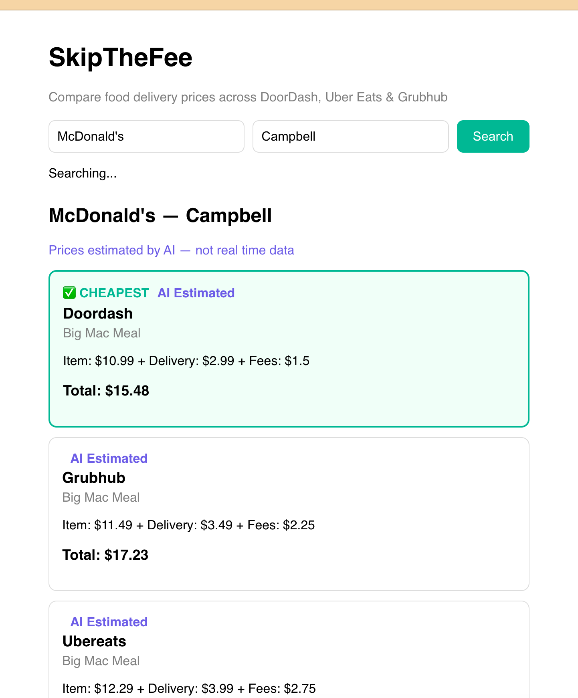

# SkipTheFee 🍔

Compare food delivery prices across DoorDash, Uber Eats & Grubhub — powered by AI.

## 🌐 Live Demo
http://18.223.134.168:3000

## 📸 Screenshot


## 🛠️ Tech Stack
- **Frontend:** React
- **Backend:** FastAPI (Python)
- **Database:** PostgreSQL
- **AI:** Claude API (Anthropic) — estimates prices for any restaurant
- **Deployment:** Docker + AWS EC2

## 💡 How It Works
1. User searches for a restaurant and city
2. App checks PostgreSQL database for real prices
3. If not found, Claude AI estimates prices based on known markup patterns
4. Results are sorted cheapest first with full fee breakdown

## 🚀 Run Locally
```bash
git clone https://github.com/ryan-ys-choi/skipthefee.git
cd skipthefee
cp .env.example .env  # add your API keys
docker compose up --build
```
Visit http://localhost:3000

## 🔑 Environment Variables
```
ANTHROPIC_API_KEY=your_claude_api_key
DB_PASSWORD=postgres
```

## 📚 What I Built & Learned
- Built a REST API with FastAPI and Python
- Designed a PostgreSQL database schema
- Integrated Claude AI for intelligent price estimation
- Containerized the full stack with Docker
- Deployed to AWS EC2 with Docker Compose